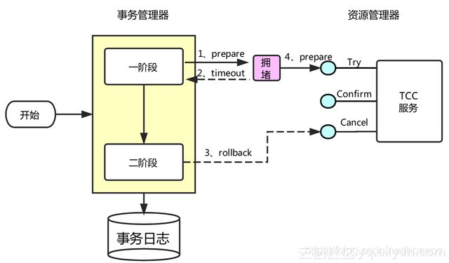

# 2PC

两阶段提交协议(Two Phase Commitment Protocol)中，涉及到两种角色

1. 一个事务协调者（coordinator）：负责协调多个参与者进行事务投票及提交(回滚)
2. 多个事务参与者（participants）：即本地事务执行者

处理步骤：

1. 投票阶段（voting phase）：协调者将通知事务参与者准备提交或取消事务，然后进入表决过程。参与者将告知协调者自己的决策：同意（事务参与者本地事务执行成功，但未提交）或取消（本地事务执行故障）；
2. 提交阶段（commit phase）：收到参与者的通知后，协调者再向参与者发出通知，根据反馈情况决定各参与者是否要提交还是回滚；

# TCC

TCC 将事务提交分为 Try - Confirm - Cancel 3个操作。其和两阶段提交有点类似，Try为第一阶段，Confirm - Cancel为第二阶段，是一种应用层面侵入业务的两阶段提交。

| 操作方法 | 含义                                                         |
| -------- | ------------------------------------------------------------ |
| Try      | 预留业务资源/数据效验                                        |
| Confirm  | 确认执行业务操作，实际提交数据，不做任何业务检查，try成功，confirm必定成功，需保证幂等 |
| Cancel   | 取消执行业务操作，实际回滚数据，需保证幂等                   |

接入 TCC 模式，最重要的事情就是考虑如何将业务模型拆成 2 阶段，实现成 TCC 的 3 个方法，并且保证 Try 成功 Confirm 一定能成功。相对于 AT 模式，TCC 模式对业务代码有一定的侵入性，但是 TCC 模式无 AT 模式的全局行锁，TCC 性能会比 AT 模式高很多。

### 幂等控制

- 使用数据库行锁；
- 条件判断，但是需要避免脏读；

### 空回滚

当 `try` `confirm`命令丢失未执行，需要保证 `cancel`命令正常执行，不会产生异常数据；

### 防悬挂

因为网络问题，先收到了 `cancel` 后收到了阻塞的 `try`;

此时，应当允许空回滚，但是要拒绝执行空回滚之后到来的一阶段Try请求；

### 事务消息

达到事务的最终一致性；[RocketMQ消息事务设计思路](https://blog.csdn.net/hosaos/article/details/90050276)

# 优缺点

| 事务方案 | 优点                                 | 缺点                                               |
| -------- | ------------------------------------ | -------------------------------------------------- |
| 2PC      | 实现简单                             | 1、需要数据库(一般是XA支持) 2、锁粒度大，性能差    |
| TCC      | 锁粒度小，性能好                     | 需要侵入业务，实现较为复杂，复杂业务实现幂等有难度 |
| 消息事务 | 业务侵入小，无需编写业务回滚补偿逻辑 | 事务消息实现难度大，强依赖第三方中间件可靠性       |

