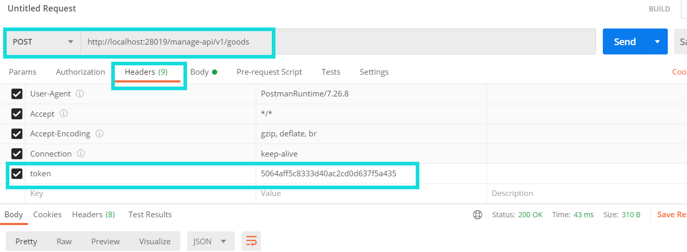
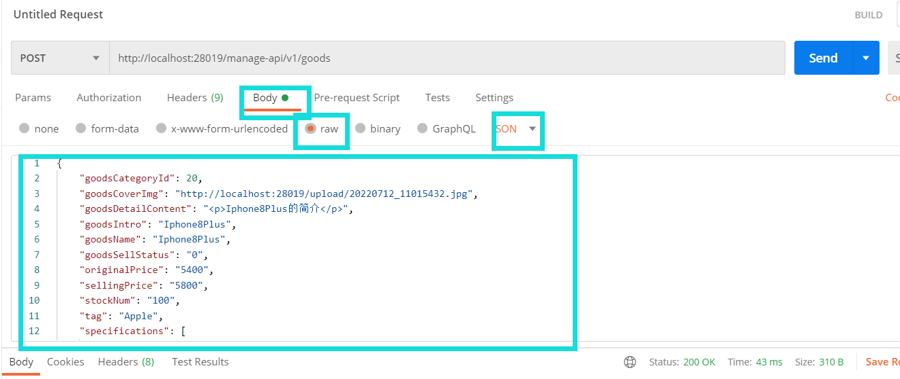

# 一个商城多SKU需求实现

## 找到现在的商品逻辑

1. 先看数据库表结构

查看现在的表：tmu_goods_info:

```sql
CREATE TABLE `tmu_goods_info` (
  `goods_id` bigint(20) unsigned NOT NULL AUTO_INCREMENT COMMENT '商品表主键id',
  `goods_name` varchar(200) NOT NULL DEFAULT '' COMMENT '商品名',
  `goods_intro` varchar(200) NOT NULL DEFAULT '' COMMENT '商品简介',
  `goods_category_id` bigint(20) NOT NULL DEFAULT '0' COMMENT '关联分类id',
  `goods_cover_img` varchar(200) NOT NULL DEFAULT '/admin/dist/img/no-img.png' COMMENT '商品主图',
  `goods_carousel` varchar(500) NOT NULL DEFAULT '/admin/dist/img/no-img.png' COMMENT '商品轮播图',
  `goods_detail_content` text NOT NULL COMMENT '商品详情',
  `original_price` int(11) NOT NULL DEFAULT '1' COMMENT '商品价格',
  `selling_price` int(11) NOT NULL DEFAULT '1' COMMENT '商品实际售价',
  `stock_num` int(11) unsigned NOT NULL DEFAULT '0' COMMENT '商品库存数量',
  `tag` varchar(20) NOT NULL DEFAULT '' COMMENT '商品标签',
  `goods_sell_status` tinyint(4) NOT NULL DEFAULT '0' COMMENT '商品上架状态 1-下架 0-上架',
  `create_user` bigint(11) NOT NULL DEFAULT '0' COMMENT '添加者主键id',
  `create_time` datetime NOT NULL DEFAULT CURRENT_TIMESTAMP COMMENT '商品添加时间',
  `update_user` bigint(11) NOT NULL DEFAULT '0' COMMENT '修改者主键id',
  `update_time` datetime NOT NULL DEFAULT CURRENT_TIMESTAMP COMMENT '商品修改时间',
  PRIMARY KEY (`goods_id`) USING BTREE
) ENGINE=InnoDB AUTO_INCREMENT=10904 DEFAULT CHARSET=utf8 ROW_FORMAT=DYNAMIC;
```
这里我们可以看到，现在根本就没有规格信息，那就不需要改造，直接加这部分功能

根据我们的设计，首先我们要考虑如何创建多规格相关的存储，这也是大部分简单业务（非领域建模的crud项目）的处理方式，先考虑数据库层的关系；

首先，根据业务来说，我们需要先处理spu，因为spu是和虚拟商品相关的，sku才是更细化的东西，就是由抽象到具体的思路，那么要思考一下，spu相关的规格数据应该满足我们什么样的需要呢？

这里如果是正常的需求开发，会有对应的原型图（就是页面上交互的示意图，比如页面上有哪些元素和布局，按钮点击、拖动等操作要有什么样的效果），我们这里可以充当产品经理，模拟想象下这里的操作：

首先，我们现有的商品管理页面是比较简单的，只能新增基本的商品信息，现在我们要构思下，如何新增多规格商品；

1. 第一步，根据我们的多规格设计，可以增加商品的通用规格，比如联想的拯救者笔记本电脑，在例子中，我们列举 CPU 相关的信息作为通用规格，这里与其说是通用规格，不如说是商品的详情参数，拯救者有 AMD 平台、 Intel 平台，对应平台下还有细分的 R3、R5、R7，i3、i5、i7 等等，这些规格参数，在搜索 笔记本电脑类 商品时，也会出现在筛选条件里面供用户勾选。分析到这里，我们可以设想下运营人员，想在商城新增 拯救者 这款商品时，要怎么操作： 在录入商品基本信息时，需要关联商品的分类，勾选笔记本电脑类别，这时页面会出现所有的笔记本电脑类商品都需要录入的详情信息：CPU 品牌、核心数、频率，笔记本尺寸等信息；
2. 第二步，运营人员录入通用规格信息之后（其实这部分是作为规格详情展示的），可以新增商品的特殊属性，比如拯救者这个商品，运营可以添加礼包套餐，供客户购买，这部分新增的规格会进行排列组合，比如新增颜色：黑色、灰色，存储：16GB、32GB，那么排列组合就有如下几个：
  - 黑色 16GB
  - 黑色 32GB
  - 灰色 16GB
  - 灰色 32GB
  运营人员这里可以设置对应规格的商品售价，库存，条码等信息，也可以把不用的组合删掉；

以上，我们作为产品，已经把大体的逻辑理差不多了，思考下，对应的功能点有哪些呢？

首先，在第一步时，通用的规格模板，显然是和分类表对应的，也就是说，我们还需要提供这个通用模板的管理入口，来对每个商品类目的通用模板进行增删改。提出一个问题，什么时间可以更改这个通用模板呢？

由于每个商品，都会根据这个模板填写信息，当修改通用规格模板时，所有的分类商品都会有影响，我们当然不希望这个模板频繁变更，但是对于更新换代比较快的商品来说，通用的规格可能也会发生变化，当通用的规格模板也不再通用，或者需要为了适应商品迭代不断更改，不仅仅增加了商城运营的成本，也提高了系统的风险。

那这个通用的模板是否还需要呢，我觉得，这个功能很难把握，自由度低了，运营要骂娘，自由度高了，开发要提刀来友好讨论，而且，这个功能出了给用户展示规格详情外，就是为了检索的时候提供统一的检索维度，从这方面来衡量，似乎，这个功能也不是那么必要，所以，作为产品经理，我们也可以大手一挥，把它砍掉🙂

这样我们需要实现的就是第二步的内容啦

根据我们的设计，多规格的SPU上，我们需要添加对应的规格信息：

```json
[{
  "group":"存储",
  "params": [
    {
      "k": "内存",
      "searchable": true,
      "global": false,
      "numerical": false,
      "unit": "GB",
      "options": ["6GB","8GB"]
    },{
      "k": "机身存储",
      "searchable": true,
      "global": false,
      "numerical": false,
      "unit": "GB",
      "options": ["256GB","128GB"]
    }
  ]
}]
```

这里我们选择使用json字符串的方式来存储，我们都知道，mysql的表字段是有对应的存储类型的，那么json字符串是什么数据类型呢？

这里我们通过sql为商品表添加这个参数：

```sql
ALTER TABLE `the_mall_union`.`tmu_goods_info` 
ADD COLUMN `specifications` varchar(3000) NULL COMMENT '规格参数模板json格式' AFTER `original_price`;
```

除此之外还需要处理我们设计的另外字段 `spec_template` 和 `indexes`，对于`indexes`由于我们需要标明它是哪个的index，所以需要加一个前缀`spec_indexs` ：

```sql
ALTER TABLE `the_mall_union`.`tmu_goods_info` 
ADD COLUMN `spec_template` varchar(1000) NULL COMMENT '特有规格选项json格式' AFTER `specifications`,
ADD COLUMN `spec_indexs` varchar(50) NULL COMMENT '特有规格值，“,”分隔' AFTER `spec_template`;
```

到现在我们表字段就建好了，下面我们要求找需要修改的接口，就是对应的controller

运行本地的管理端项目，登陆后到商品管理，我们以新增为例：

调用接口：【POST】/manage-api/v1/goods

传参:

```json
{
    "goodsCategoryId": 20,
    "goodsCoverImg": "http://localhost:28019/upload/20220712_11015432.jpg",
    "goodsDetailContent": "<p>商品详情123</p>",
    "goodsIntro": "商品简介",
    "goodsName": "测试商品",
    "goodsSellStatus": "0",
    "originalPrice": "12",
    "sellingPrice": "22",
    "stockNum": "100",
    "tag": "test"
}
```

我们首先需要从接口来做调整，一般前后端分离的开发项目，需要和前端开发人员预先沟通好，现在是我们自己做，就可以自己定啦

首先确认，需要新增参数：

1. `specifications`
2. `spec_template`
3. `spec_indexs`

下一步确认添加参数的类型，这里是String类型

开发过程中，如果有接口文档的话，这里需要更新对应的接口文档，咱们没有，就直接调整后端接口

开发之前，需要将git调整到开发分支： dev-multi-sku

根据接口地址定位到 Controler： AdminGoodsInfoAPI@save

在参数上添加我们新增的参数 GoodsAddParam

```java
    @ApiModelProperty("规格参数模板json格式")
    private String specifications;

    @ApiModelProperty("特有规格选项json格式")
    private String specTemplate;

    @ApiModelProperty("特有规格值，','分隔")
    private String specIndexs;
```

添加完参数后，我们需要对添加的参数做处理，找到对应的service处理的代码 `goodsService.saveMallGoods()`

找到实现类上的业务方法 `GoodsServiceImpl@saveMallGoods`

我们首先分析下该方法的逻辑：

```java
    @Override
    public String saveMallGoods(Goods goods) {
        // 首先查询传的分类ID，校验分类是否存在
        GoodsCategory goodsCategory = goodsCategoryMapper.selectByPrimaryKey(goods.getGoodsCategoryId());
        // 分类不存在或者不是三级分类，则该参数字段异常，一般商品都关联在最低一级
        if (goodsCategory == null || goodsCategory.getCategoryLevel().intValue() != CategoryLevelEnum.LEVEL_THREE.getLevel()) {
            return ServiceResultEnum.GOODS_CATEGORY_ERROR.getResult();
        }
        // 看看这个商品有没有同名的，也是校验，有时候是不需要这个校验的
        if (goodsMapper.selectByCategoryIdAndName(goods.getGoodsName(), goods.getGoodsCategoryId()) != null) {
            return ServiceResultEnum.SAME_GOODS_EXIST.getResult();
        }
        // 插入商品记录，返回影响条数，影响条数≤0 就有异常
        if (goodsMapper.insertSelective(goods) > 0) {
            return ServiceResultEnum.SUCCESS.getResult();
        }
        return ServiceResultEnum.DB_ERROR.getResult();
    }
```

这里展现了大部分方法的通用逻辑：

1. 校验参数有效性
2. 执行业务
3. 返回返回值

现在思考下，怎么才能让我们新加的字段存到数据库里面呢

首先，得传进来，对吧，先得有才行

我们决定现在`Goods` 类上添加我们刚加的属性，然后在mapper里面添加这几个字段的insert内容就可以了，大功告成！

等等，回到我们刚看的方法逻辑，发现了没有? 没有参数校验啊！

新加的参数是什么？是 `String`, 怎么校验呢？

思考如下几个问题

1. 新加的字段可以为空吗？
2. 什么时候可以为空？
3. 不为空的话应该满足什么规则？

通过思考，有如下几个基本条件需要满足：

1. 这几个字段如果为空，就一定都是空
2. `specTemplate` 和 `specifications` 都是 `json`，如果不为空，应该都不为空，而且需要满足我们设计的json格式
3. `specIndexs` 这个字段也不能为空，如果前面不是空的话

空字符串好判断，那么json格式怎么处理呢

我们一般使用json序列化工具来，所谓的序列化就是把json字符串解析成对象，把对象转为json字符串的工具，可以用fastjson 或者 Gson

我们就用通用的fastjson来做吧，首先需要引入fastjson的maven依赖

拿到json字符串之后，做空值判断，不为空则可以使用fastjson解析成对象

等等，对象，还没，创建呢！

赶紧通过json格式创建个java对象出来

这样我们就可以尝试做新加字段有效性判断啦！

接下来，还有一个新字段 `specIndexs`

坏了，不知道你发现了一个问题没有

我们是要做多规格，相当于原来调用一个接口创建一个商品，而我们现在是要一次新增接口创建多个商品呀！

存储这部分就得重新考虑了

现在我们就只有一个表 `goods_info` 这里就需要考虑一个问题，sku 存哪里

一般这里我们有两种方法，一个是，还和原来的数据存一起，新增标志位来区分它是sku还是spu，这里还需要新增字段存储spu和sku的对应关系，比如这样：

|spu_id|sku_id|goods_name|is_sku|
|--|--|--|--|
|8866345|null|我是Iphone8|0|
|8866345|8866346|我是Iphone8-黑色512GB|1|
|8866345|8866347|我是Iphone8-粉色512GB|1|

这种存储的问题在于数据集中，导致有冗余重复的字段或者空字段，存储上是比较浪费的，好处就是实现比较简单

另一个就是sku 和 spu 拆为两个表来存储，虽然代码逻辑比较复杂，但是整体存储，逻辑结构都是比较清晰的，这里我们选择一步到位，分开存储

分别存储首先从数据库层面考虑，如何才能合理的分配spu和sku两个表的字段信息，我们可以发现，sku很多信息都是用的spu的，比如商品名称、详情，sku特有的信息有如下几个：

- goods_info_id
- own_spec
- spec_indexs
- stock_num
- original_price
- selling_price
- goods_sell_status

这里注意了，因为之前我们没考虑到这个问题，把 spec_indexs 字段加到 goods_info 表了，就是spu的表，这里要把它删掉

建sku表

```sql
CREATE TABLE `tmu_goods_info_sku` (
  `goods_sku_id` bigint(20) unsigned NOT NULL AUTO_INCREMENT COMMENT '商品表主键id',
  `goods_id` bigint(20) NOT NULL COMMENT '商品表主键id',
  `original_price` int(11) NOT NULL DEFAULT '1' COMMENT '商品价格',
  `selling_price` int(11) NOT NULL DEFAULT '1' COMMENT '商品实际售价',
  `stock_num` int(11) unsigned NOT NULL DEFAULT '0' COMMENT '商品库存数量',
  `goods_sell_status` tinyint(4) NOT NULL DEFAULT '0' COMMENT '商品上架状态 1-下架 0-上架',
  `spec_indexs` varchar(50) NULL COMMENT '特有规格值，“,”分隔',
  `own_spec` varchar(200) NULL COMMENT '特有属性的键值对,json格式',
  `create_user` bigint(11) NOT NULL DEFAULT '0' COMMENT '添加者主键id',
  `create_time` datetime NOT NULL DEFAULT CURRENT_TIMESTAMP COMMENT '商品添加时间',
  `update_user` bigint(11) NOT NULL DEFAULT '0' COMMENT '修改者主键id',
  `update_time` datetime NOT NULL DEFAULT CURRENT_TIMESTAMP COMMENT '商品修改时间',
  PRIMARY KEY (`goods_sku_id`) USING BTREE
) ENGINE=InnoDB AUTO_INCREMENT=1 DEFAULT CHARSET=utf8 ROW_FORMAT=DYNAMIC;
```

调整之后的 spu 表

```sql
CREATE TABLE `tmu_goods_info` (
  `goods_id` bigint(20) unsigned NOT NULL AUTO_INCREMENT COMMENT '商品表主键id',
  `goods_name` varchar(200) NOT NULL DEFAULT '' COMMENT '商品名',
  `goods_intro` varchar(200) NOT NULL DEFAULT '' COMMENT '商品简介',
  `goods_category_id` bigint(20) NOT NULL DEFAULT '0' COMMENT '关联分类id',
  
  `goods_cover_img` varchar(200) NOT NULL DEFAULT '/admin/dist/img/no-img.png' COMMENT '商品主图',
  `goods_carousel` varchar(500) NOT NULL DEFAULT '/admin/dist/img/no-img.png' COMMENT '商品轮播图',
  `goods_detail_content` text NOT NULL COMMENT '商品详情',
  `original_price` int(11) NOT NULL DEFAULT '1' COMMENT '商品价格',
  `selling_price` int(11) NOT NULL DEFAULT '1' COMMENT '商品实际售价',
  `specifications` varchar(3000) NULL COMMENT '规格参数模板json格式',
  `spec_template` varchar(1000) NULL COMMENT '特有规格选项json格式,
  `stock_num` int(11) unsigned NOT NULL DEFAULT '0' COMMENT '商品库存数量',
  `tag` varchar(20) NOT NULL DEFAULT '' COMMENT '商品标签',
  `goods_sell_status` tinyint(4) NOT NULL DEFAULT '0' COMMENT '商品上架状态 1-下架 0-上架',
  `create_user` bigint(11) NOT NULL DEFAULT '0' COMMENT '添加者主键id',
  `create_time` datetime NOT NULL DEFAULT CURRENT_TIMESTAMP COMMENT '商品添加时间',
  `update_user` bigint(11) NOT NULL DEFAULT '0' COMMENT '修改者主键id',
  `update_time` datetime NOT NULL DEFAULT CURRENT_TIMESTAMP COMMENT '商品修改时间',
  PRIMARY KEY (`goods_id`) USING BTREE
) ENGINE=InnoDB AUTO_INCREMENT=10904 DEFAULT CHARSET=utf8 ROW_FORMAT=DYNAMIC;
```

数据库调整好了，需要创建对应的实体，之前我们调整好了spu，现在创建sku即可

```java
package harvester.union.mall.entity;

import com.fasterxml.jackson.annotation.JsonFormat;
import lombok.Data;

import java.util.Date;

@Data
public class GoodsInfo {

    private Long goodsSkuId;

    private Long goodsId;

    private Integer originalPrice;

    private Integer sellingPrice;

    private Integer stockNum;

    private Byte goodsSellStatus;

    private String ownSpec;

    private String specIndexs;

    private Integer createUser;

    @JsonFormat(pattern = "yyyy-MM-dd HH:mm:ss", timezone = "GMT+8")
    private Date createTime;

    private Integer updateUser;

    @JsonFormat(pattern = "yyyy-MM-dd HH:mm:ss", timezone = "GMT+8")
    private Date updateTime;
}
```

到此为止，我们应该意识到，之前定义的接口也需要调整了

```json
{
    "goodsCategoryId": 20,
    "goodsCoverImg": "http://localhost:28019/upload/20220712_11015432.jpg",
    "goodsDetailContent": "<p>Iphone8Plus的简介</p>",
    "goodsIntro": "Iphone8Plus",
    "goodsName": "Iphone8Plus",
    "goodsSellStatus": "0",
    "originalPrice": "5400",
    "sellingPrice": "5800",
    "stockNum": "100",
    "tag": "Apple",
    "specifications": [
        {
            "group": "主芯片",
            "params": [
                {
                    "k": "CPU品牌",
                    "searchable": true,
                    "global": true,
                    "v": "Apple"
                },
                {
                    "k": "CPU型号",
                    "searchable": false,
                    "global": true,
                    "v": "A11 仿生"
                },
                {
                    "k": "CPU核数",
                    "searchable": true,
                    "global": true,
                    "v": "六核"
                },
                {
                    "k": "CPU频率",
                    "searchable": true,
                    "global": true,
                    "numerical": true,
                    "unit": "Ghz",
                    "v": "2.39"
                }
            ]
        }
    ],
    "specTemplate": [
        {
            "group": "存储",
            "params": [
                {
                    "k": "机身存储",
                    "searchable": true,
                    "global": false,
                    "numerical": false,
                    "unit": "GB",
                    "options": [
                        "128GB",
                        "256GB"
                    ]
                }
            ]
        },
        {
            "group": "颜色",
            "params": [
                {
                    "k": "机身颜色",
                    "searchable": true,
                    "global": false,
                    "numerical": false,
                    "unit": "",
                    "options": [
                        "磨砂黑",
                        "玫瑰金",
                        "皓月白"
                    ]
                }
            ]
        }
    ],
    "specificationList": [
        {
            "ownSpec": {
                "机身存储": "128GB",
                "机身颜色": "玫瑰金"
            },
            "specIndexs": "0,1",
            "originalPrice": 5400,
            "sellingPrice": 5800,
            "stockNum": 100,
            "goodsSellStatus": 0
        },{
            "ownSpec": {
                "机身存储": "256GB",
                "机身颜色": "磨砂黑"
            },
            "specIndexs": "1,0",
            "originalPrice": 5400,
            "sellingPrice": 5800,
            "stockNum": 100,
            "goodsSellStatus": 0
        }
    ]
}
```

到这里，可能会有点懵，咋出来的这是，下面简要说明一下

对于一个新增商品，用户创建的时候其实是创建了一个spu和多个sku，如果是多规格的话。

这就是典型的一对多的关系，新增对应的数据库操作也是对应的，所以，对于sku的数据，我们用一个 `specificationList` 来传，除了这个之外其他的都是之前讨论过的

定义好传参格式，前后端就可以各自开发啦

对于我们后端开发来说，第一步，接受参数

关注的点是，请求地址，请求方法，请求参数传参方式

请求地址、请求方法前面已经说明了，我们也找到了对应的controller方法入口，传参方法是通过body传参，和原来一样，下面需求做的就是接收前端传来的参数

spinrgboot 框架已经做了参数解析的工作了，我们只需要在接收对象里面添加参数就可以了，为了解析方便，我们把json的对象也创建一下 `SpecificationItem`

```java
package harvester.union.mall.api.admin.param;
import lombok.Data;
import java.util.List;

/**
 * 规格单元
 */
@Data
public class SpecificationItem {

    private String group;
    
    private List<SpecificationParams> params;
    
    public static class SpecificationParams {

        private String k;

        private String v;
        
        private boolean searchable;
        
        private boolean global;
        
        private boolean numerical;
        
        private String unit;
        
        private List<String> options;
    }
}

```

还有存储多规格信息的对象：

```java
package harvester.union.mall.api.admin.param;

import java.util.Map;

/**
 * SKU规格信息
 * @author HJY
 * @date 2022/7/14
 */
public class GoodsInfoAddParam {

    private Map<String, String> ownSpec;
    
    private String specIndexs;
    
    private Integer originalPrice;
    
    private Integer sellingPrice;
    
    private Integer stockNum;
    
    private Byte goodsSellStatus;
}
```

将该参数添加到 `GoodsAddParam` 中，我们在这个类中新增的字段就是如下几个：

```java
    @ApiModelProperty("规格参数模板json格式")
    private List<SpecificationItem> specifications;

    @ApiModelProperty("特有规格选项json格式")
    private List<SpecificationItem> specTemplate;

    @ApiModelProperty("多SKU信息")
    private List<GoodsInfoAddParam> specificationList;
```

这下我们的参数接收就搞定了，这里参数只传递到了controller方法里面，还没有传到 service 中，这里我们把这个参数处理好了，赋值给service的入参 goods 吧

赋值之前，先添加需要加的参数，做好接收准备工作：

```java
private List<SpecificationItem> specificationList;
```
另外两个 `specifications` 和 `specTemplate` 参数，在 `GoodsAddParam` 和 `Goods` 中类型是不匹配的，`Goods` 中新增字段是string，我们需要把 `GoodsAddParam` 中字段的值变成json字符串：

maven中引入fastjson：

```xml
        <dependency>
            <groupId>com.alibaba</groupId>
            <artifactId>fastjson</artifactId>
            <version>1.2.79</version>
        </dependency>
```

转json字符

controller 中对应的代码：
```java
        Goods goods = new Goods();
        BeanUtil.copyProperties(goodsAddParam, goods);
        // 将参数赋值goods
        if (!CollectionUtils.isEmpty(goodsAddParam.getSpecifications())) {
            goods.setSpecifications(JSONObject.toJSONString(goodsAddParam.getSpecifications()));
        }
        if (!CollectionUtils.isEmpty(goodsAddParam.getSpecTemplate())) {
            goods.setSpecTemplate(JSONObject.toJSONString(goodsAddParam.getSpecTemplate()));
        }
```

操作参数前进行对应的判空是个良好的习惯，可以让你避免大量的 `NullPointException`🙂

下面处理sevice,  原来的service流程上面梳理过了，思考下，新增的逻辑是什么呢？

1. 参数校验
2. 存储spu
3. 存储sku
4. 返回信息

呐，就是新增sku这部分，和处理spu新增字段的部分

spu新增字段我们在对应的dao层处理就可以了，得益于mybatis，我们只需要在xml中新增映射关系就可以了，修改的`xml`： `GoodsMapper.xml`， 修改的`xmlid`:  `insertSelective`

在存储spu代码后面，添加存储sku的代码，此时我们发现，sku的基础方法都没有，毕竟是新增的表嘛，基础都需要重来一遍，创建对应的实体类、xml、dao即可，这里只需要创建最基本的增删查方法，我只新增了这几个方法：

```java
   int deleteByGoodsId(Long goodsId);

    GoodsInfo selectByPrimaryKey(Long goodsInfoId);

    GoodsInfo selectByGoodsId(Long goodsId);

    int batchInsert(@Param("mallGoodsInfoList") List<GoodsInfo> goodsInfos);

    int updateStockNum(@Param("stockNumDTOS") List<StockNumDTO> stockNumDTOS);

    int batchUpdateSellStatus(@Param("goodsInfoIds")Long[] goodsInfoIds,@Param("sellStatus") int sellStatus);
```

最重要的是前三个，为了省事，我还新加了一个批量新增的方法，其他的，后面的暂时也用不到，可能有小伙伴这里有疑问：为什么没有改的方法呢，这是因为，从业务梳理上来说，目前我们这个系统里面sku只会修改对应的上下架和库存，修改sku数据的话可以直接全部删除，再重新插入就可以了，所以这里只有两个批量修改一个字段的方法，而且第一个的删除方法也是批量删除。

这里就不再贴代码了，具体的可以切到对应开发分支查看

做好这部分工作之后，就可以继续处理刚刚的新增啦

首先注入我们新增加的sku 的dao：

```java
    @Autowired
    private GoodsInfoMapper goodsInfoMapper;
```

再处理sku插入的时候，我们发现，插入之前必须能拿到插入spu的id，才能将spu和sku关联起来，但是目前只返回影响行数

这里我们要对spu的插入做改造：

我们在 `GoodsMapper.xml` 的 `insertSelective` 上添加如下属性：

```xml
useGeneratedKeys="true" keyProperty="goodsId"
```

就可以拿到插入的id啦，你问我怎么知道的，简单，当然是百度啦

这里我们调整service代码如下（先自己实现哦，做好了可以对照一下，这里的实现也不一定合理）：

```java
GoodsCategory goodsCategory = goodsCategoryMapper.selectByPrimaryKey(goods.getGoodsCategoryId());
        // 分类不存在或者不是三级分类，则该参数字段异常
        if (goodsCategory == null || goodsCategory.getCategoryLevel().intValue() != CategoryLevelEnum.LEVEL_THREE.getLevel()) {
            return ServiceResultEnum.GOODS_CATEGORY_ERROR.getResult();
        }
        if (goodsMapper.selectByCategoryIdAndName(goods.getGoodsName(), goods.getGoodsCategoryId()) != null) {
            return ServiceResultEnum.SAME_GOODS_EXIST.getResult();
        }
        // 插入spu
        if (goodsMapper.insertSelective(goods) <= 0) {
            return ServiceResultEnum.DB_ERROR.getResult();
        }
        // 插入sku
        if (!CollectionUtils.isEmpty(goods.getSpecificationList())) {
            // 先全部删掉
            goodsInfoMapper.deleteByGoodsId(goods.getGoodsId());
            // 构建参数
            List<GoodsInfo> goodsInfos = new ArrayList<>(goods.getSpecificationList().size());
            for (GoodsInfoAddParam goodsInfoAddParam : goods.getSpecificationList()) {
                GoodsInfo goodsInfo = new GoodsInfo();
                goodsInfo.setGoodsId(goods.getGoodsId());
                goodsInfo.setGoodsSellStatus(goodsInfoAddParam.getGoodsSellStatus());
                goodsInfo.setOriginalPrice(goodsInfoAddParam.getOriginalPrice());
                goodsInfo.setSellingPrice(goodsInfoAddParam.getSellingPrice());
                goodsInfo.setOwnSpec(JSONObject.toJSONString(goodsInfoAddParam.getOwnSpec()));
                goodsInfo.setSpecIndexs(goodsInfoAddParam.getSpecIndexs());
                goodsInfo.setStockNum(goodsInfoAddParam.getStockNum());
                goodsInfo.setCreateUser(goods.getCreateUser());
                goodsInfos.add(goodsInfo);
            }
            // 插入数据
            goodsInfoMapper.batchInsert(goodsInfos);
        }
        return ServiceResultEnum.SUCCESS.getResult();
```

现在代码写好了，我们要通过postman进行接口调试

postman 就是发送http请求的工具，除了它还有其他一大票的工具可以用，方法都是一样的，调试之前，要明确几个点：

- 接口所在地址（url）
- 接口请求方式
- 接口是否需要身份验证
- 接口请求参数，传参方法

在这个接口中，如果是本地的项目，我们的请求地址就是

>   http://localhost:28019/manage-api/v1/goods

请求方法是 post

身份验证，我们找到自己本地起的前端项目，打开之后登陆进去，在浏览器的开发者工具中，查看http请求，我们只要关注请求头就可以了，这是其中的一个：

```properties
GET /manage-api/v1/categories?pageNumber=1&pageSize=1000&categoryLevel=1&parentId=0 HTTP/1.1
Accept: application/json, text/plain, */*
Accept-Encoding: gzip, deflate, br
Accept-Language: zh-CN,zh;q=0.9
Connection: keep-alive
Cookie: p_h5_upload_u=B71AD248-18E2-40B8-9273-7204864D9A48; Idea-4abee205=1a1d4369-3811-426e-8837-c0836106b89c
Host: localhost:28019
Origin: http://localhost:3000
Referer: http://localhost:3000/
Sec-Fetch-Dest: empty
Sec-Fetch-Mode: cors
Sec-Fetch-Site: same-site
User-Agent: Mozilla/5.0 (Windows NT 10.0; Win64; x64) AppleWebKit/537.36 (KHTML, like Gecko) Chrome/103.0.0.0 Safari/537.36
X-Requested-With: XMLHttpRequest
sec-ch-ua: ".Not/A)Brand";v="99", "Google Chrome";v="103", "Chromium";v="103"
sec-ch-ua-mobile: ?0
sec-ch-ua-platform: "Windows"
sentry-trace: f9da873ff4a54db488ca71b7aa5c6e53-a8221bacc0c56cb0-1
token: 5064aff5c8333d40ac2cd0d637f5a435
```

主要关注的是带有 `token`、 `auth` 这类的请求头字段，显然我们找到了一组：

>    token: 5064aff5c8333d40ac2cd0d637f5a435

我们在请求的时候，加上这个header就可以啦！

最后再加上我们的请求参数，就可以调试了，截图中我已经把注意的点都用蓝色框框，框起来了




最后，调试中，会发现目前还没注意到的问题，保存的时候 `creatUser` 没有赋值，而且变量类型还不一致，我是直接都改成了 `Long` 类型，好的，这次就到这里啦~~886


